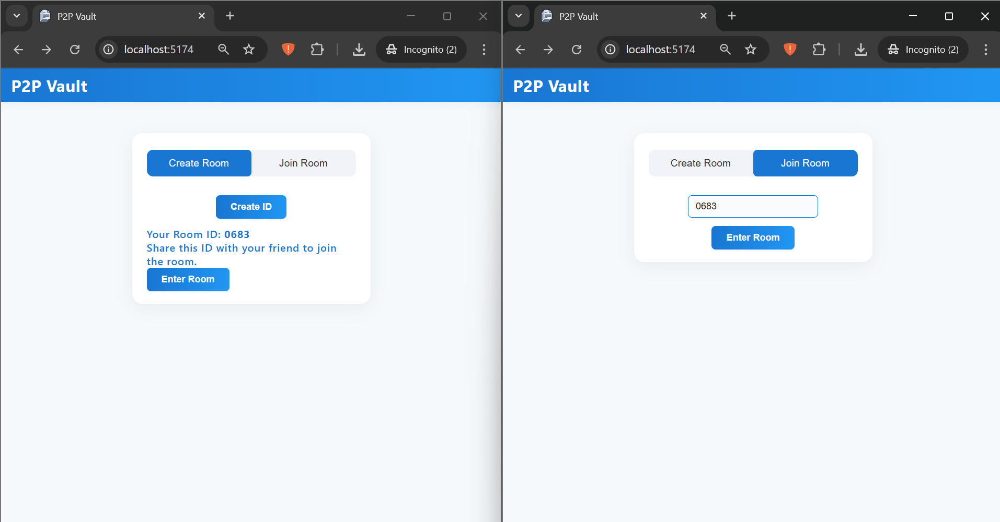
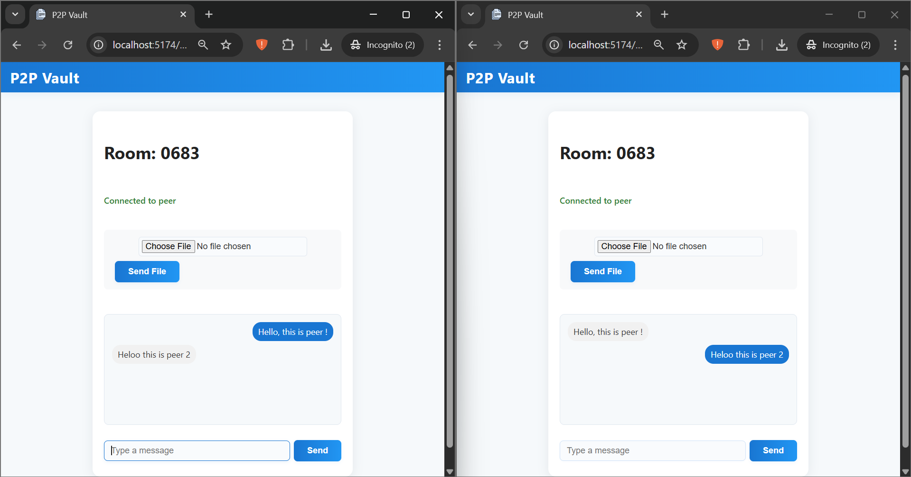
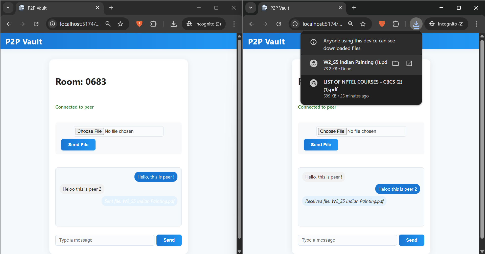

# 🚀 P2P Vault
## A Secure Peer to Peer File Sharing & Chat Application

> **A secure, real-time, end-to-end encrypted peer-to-peer file transfer and chat application, built as part of my Computer Networks course.**

---

## 📌 Overview

This project implements a **secure and private** peer-to-peer communication system using **WebRTC** and **Socket.io**, with **AES-based encryption** for file sharing. It enables direct browser-to-browser communication, eliminating the need for server-side storage.

> ✅ Designed for seamless, encrypted communication  
> ✅ Developed as part of my academic coursework on Computer Networks
> ✅ Built with guidance from **Prof. Dr. Neelanarayanan V**  

---

## ✨ Features

- 🔒 **End-to-End Encryption:** AES encryption ensures data security.
- 💬 **Real-Time Chat:** Instant, secure chat messages between users.
- 📁 **Direct File Transfers:** Send files of any size/type directly P2P.
- 🧠 **No Server Storage:** Files never touch any server.
- 🔑 **Room-Based Sessions:** Secure 4-digit room codes for easy access.
- 📶 **Live Connection Status:** Know when peers are connected and ready.

---

## 📸 Demo & Screenshots

| Home Page | Chat Room | File Transfer |
|-----------|-----------|---------------|
|  |  |  |

---

## ⚙️ How It Works

1. **Create or Join a Room:**  
   One user creates a room (gets a 4-digit code), another joins using that code.

2. **Secure Signaling:**  
   `Socket.io` handles signaling and room management between clients.

3. **Peer-to-Peer Connection:**  
   `WebRTC` establishes a direct encrypted link between peers.

4. **Encrypted Communication:**  
   - Files are AES-encrypted client-side before sending.  
   - Chat messages are sent securely via WebRTC DataChannels.

5. **Private & Ephemeral:**  
   Data is **never stored on a server** and vanishes after transfer.

---

## 🚀 Getting Started

### ✅ Prerequisites

- [Node.js](https://nodejs.org/)
- [npm](https://www.npmjs.com/)

---

### 📦 Installation

1. **Clone the Repository**
   ```bash
   git clone https://github.com/yourusername/your-repo-name.git
   cd your-repo-name
   ```

2. **Install Backend Dependencies**
   ```bash
   cd server
   npm install
   ```

3. **Install Frontend Dependencies**
   ```bash
   cd ../client
   npm install
   ```

---

### 🧪 Running the App Locally

1. **Start the Backend Server**
   ```bash
   cd server
   npm run dev
   ```

2. **Start the Frontend App**
   ```bash
   cd ../client
   npm run dev
   ```

3. **Visit in Browser**  
   Open: [http://localhost:5174](http://localhost:5174)

---

## 🗂️ Project Structure

```
project-root/
│
├── client/        # React frontend (UI, WebRTC, Encryption)
│   └── ...
├── server/        # Node.js + Socket.io backend (signaling)
│   └── ...
├── screenshots/   # (Optional) Screenshots for README
├── README.md
└── ...
```

---

## 🙏 Acknowledgements

- 👨‍🏫 [Prof. Dr. Neelanarayanan V](https://www.linkedin.com/in/neelanarayanan-venkatraman-21b1801/) — for expert guidance and mentorship.
- ⚙️ [WebRTC](https://webrtc.org/) — for browser-based peer-to-peer connections.
- 🔌 [Socket.io](https://socket.io/) — for real-time communication.
- 🧰 [Simple-Peer](https://github.com/feross/simple-peer) — for simplified WebRTC integration.

---

## ⭐ Contributing & Support

If you find this project helpful or inspiring, consider giving it a ⭐ on GitHub or mentioning it in your work.

> _Feedback, suggestions, and contributions are always welcome!_

---
